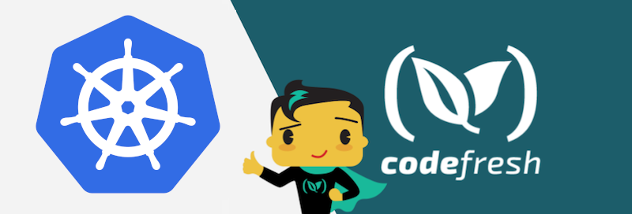

# Trigger a Kubernetes Deployment from a Dockerhub Push Event 


This is a Git repository that holds a Node application and a Dockerfile. The dockerfile is also at the root folder of the project. Our example will have two pipelines.  One that is responsible for packaging code (CI), and the other will be responsible for deploying code (CD).

## Packaging the Node.js app Locally

To compile and package using Docker 

```bash
docker build . -t registry-trigger-sample-app
```

## Running the docker image

```bash
docker run -p 3000:3000 registry-trigger-sample-app
```

and then visit http://localhost:3000 in your browser.

## Deploying to Kubernetes

```bash
kubectl run registry-trigger-sample-app --image=annabaker/registry-trigger-sample-app:latest --port=3000 --generator=run-pod/v1
kubectl expose deployment my-app --type=LoadBalancer --port=3000 --target-port=3000
```
Use `kubectl get svc` to obtain the external IP of the service you just exposed and access the application on http://YOUR.EXTERNAL.IP:3000.

## To use this project in Codefresh

There is also a [codefresh-CI-pipeline.yml](codefresh-CI-pipeline.yml) and [codefresh-CD-pipeline.yml](codefresh-CD-pipeline.yml) for easy usage with the [Codefresh](codefresh.io) CI/CD platform.

More details can be found in [Codefresh documentation](https://codefresh.io/docs/docs/yaml-examples/examples/trigger-a-k8s-deployment-from-docker-registry/).

